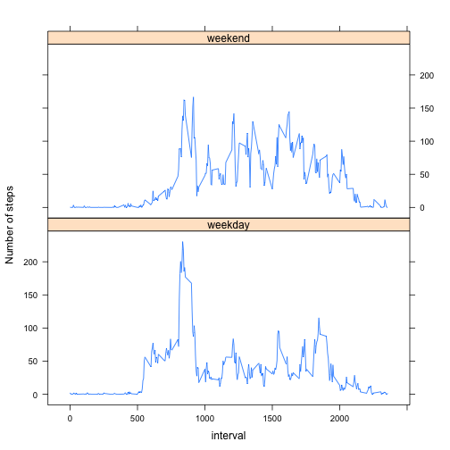

Reproducible Research Peer Assessment 1
==============================================


## Loading the data

```r
data<-read.csv("activity.csv")
```


## What is mean total number of steps taken per day?

```r
total_steps<-tapply(data$steps, data$date, sum)
hist(total_steps)
```

 

```r
data.frame(mean=mean(total_steps, na.rm=TRUE), median=median(total_steps, na.rm=TRUE))
```

```
##       mean median
## 1 10766.19  10765
```

```r
# If I ignore the NAs when constructing the data frame
# there will be erroe "row names contain missing values"
# So I set na.rm=TRUE
```


## What is the average daily activity pattern?

```r
interval<-unique(data$interval)
average_steps<-tapply(data$steps, data$interval, mean, na.rm=TRUE)
plot(interval, average_steps, type="l")
```

 

```r
m<-row.names(average_steps)[order(average_steps)[length(average_steps)]]
print(paste("The interval containing the maximum number of steps on average across all the days in the dataset is", m))
```

```
## [1] "The interval containing the maximum number of steps on average across all the days in the dataset is 835"
```


## Imputing missing values

```r
n<-sum(is.na(data$steps))
print(paste("Total numer of missing values is", as.character(n)))
```

```
## [1] "Total numer of missing values is 2304"
```

```r
new_data<-data
# Use mean of 5 minutes to fill the NAs
new_data$steps[is.na(new_data$steps)]<-rep(average_steps,61)[is.na(new_data$steps)]
new_total<-tapply(new_data$steps, new_data$date, sum)
hist(new_total)
```

 

```r
data.frame(mean=mean(new_total), median=median(new_total))
```

```
##       mean   median
## 1 10766.19 10766.19
```
These values are different from the estimates from the first part.
Imputing missing data corrects the potential bias caused by missing data.


## Are there differences in activity patterns between weekdays and weekends?

```r
day<-weekdays(as.Date(data$date))
days<-ifelse(day=="Saturday" | day=="Sunday", "weekend", "weekday")
data3<-cbind(new_data, day=days)
mean1<-tapply(data3$steps[data3$day=="weekend"], 
              data3$interval[data3$day=="weekend"], mean)
mean2<-tapply(data3$steps[data3$day=="weekday"], 
              data3$interval[data3$day=="weekday"], mean)
data4<-data.frame(mean=c(mean1, mean2), 
                  day=c(rep("weekend", 288), rep("weekday",288)),
                  interval=rep(interval,2))
library(lattice)
xyplot(mean~interval|day, data=data4, layout=c(1,2), type="l", ylab="Number of steps")
```

 
